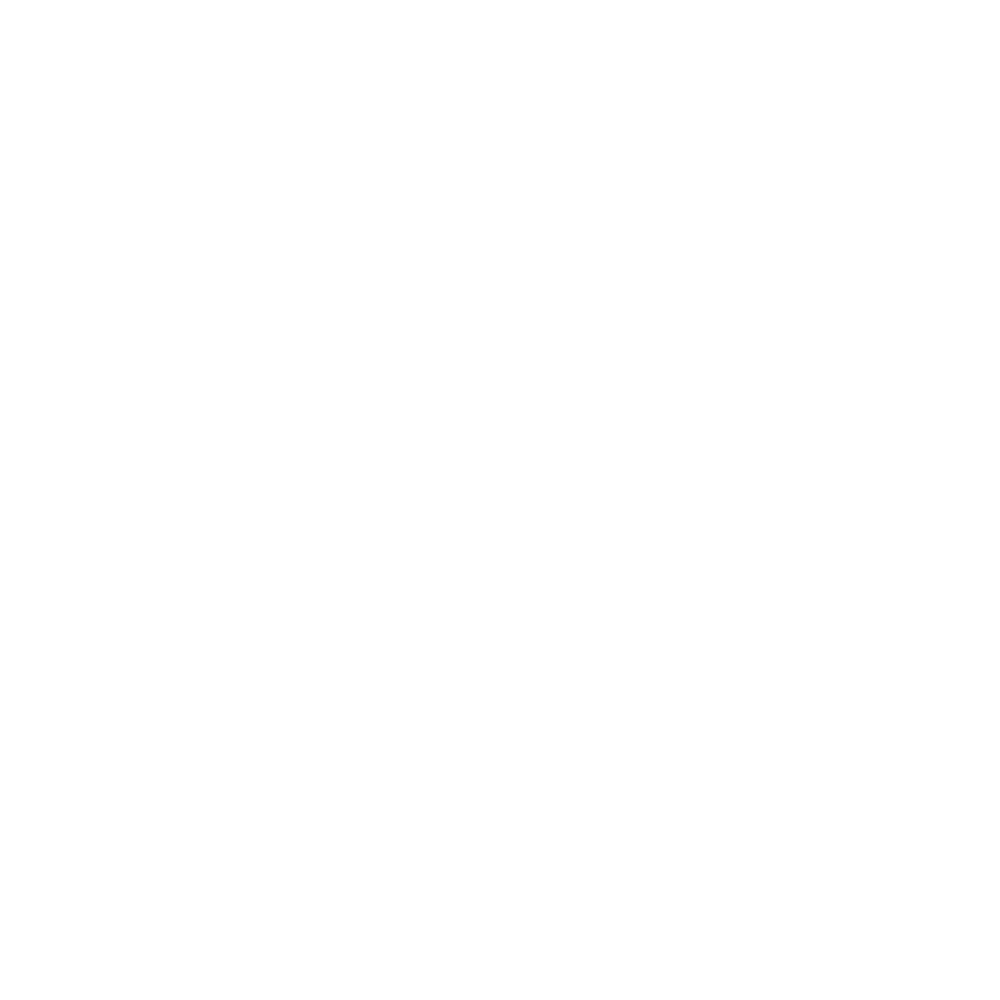

# RAS-reShape
RAS-reShape is a CNN trained on Google QuickDraw sketches to recognize hand-drawn shapes like circles, rectangles, triangles, lines, and random doodles. Built for real-time raster shape beautification systems.
<p align="center">
  
</p>


<h1 align="center">More info</h1>

<p align="center">
  <b>shape classification for sketch beautification</b><br>
  <i>Trained on human-drawn sketches from Google’s QuickDraw dataset</i>
</p>

---

## Overview

**RAS-reShape** is a Convolutional Neural Network (CNN) designed to recognize common hand-drawn shapes — such as circles, rectangles, triangles, and lines — in real time. It is part of a larger system that automatically beautifies shapes drawn on a canvas.

> The model also smartly ignores irregular, abstract doodles, making it ideal for creative apps and sketch-based UIs.

---

##  Fixation

| Input | Output |
|-------|--------|
|  |  |
|  |  |
|  | *Ignored* (no beautification) |

- `circle`
- `rectangle`
- `triangle`
- `line`
- `none` (random doodle)

---

## How It Works (Abstracted)

RAS-reShape learns from thousands of real human sketches using the [QuickDraw dataset](https://quickdraw.withgoogle.com/data). The CNN model is trained to classify a sketch into one of five shape categories. Once a shape is confidently identified, it is "beautified" by replacing it with a mathematically perfect version in real time.

> If a drawing doesn’t resemble any shape, the model does nothing — maintaining the integrity of the original sketch.

---

## Architecture

Input (64x64 grayscale image)
↓
Conv2D → ReLU → MaxPool
↓
Conv2D → ReLU → MaxPool
↓
Flatten → Dense(128) → Dropout
↓
Softmax Output (5 classes)

##  Quick Start

### 1. Install Dependencies

```bash
pip install -r requirements.txt
